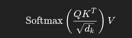
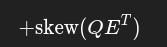

core Transformer building blocks used to train a Music Transformer — a neural network that learns to generate music sequences (tokens representing notes, durations, etc.).

It’s inspired by:

Vaswani et al. (2017) – “Attention Is All You Need” (original Transformer)

Huang et al. (2018) – “Music Transformer: Generating Music with Long-Term Structure” (adds relative attention)

The transformer model is built from repeated decoder layers, each containing:

1. Multi-Head Attention (MHA): learns relationships between positions(notes).
2. Feed-Forward Network (FFN): processes features position-wise.
3. Residual connections + LayerNorm: stabilize and speed up training.

This file defines:

How attention works (with relative position embeddings for music)

The multi-head attention module

The feed-forward network

The decoder layer (1 layer of the Transformer)

abs_positional_encoding(max_position, d_model, n=3)

Computes sinusoidal position embeddings (like in the original Transformer).

Adds positional information to the model.

Returns a tensor of shape (1, ..., max_position, d_model).

skew(t)

Implements the “skewing trick” from Huang et al. (2018).

When calculating relative attention, we get a matrix where each column corresponds to a relative distance.
To align these correctly (so position i attends to i−k), we “skew” the matrix — shifting columns into diagonals.

Steps:

Pad t

Reshape it

Slice off the extra padding

This rearranges the attention logits so relative positions line up correctly.

rel_scaled_dot_prod_attention(q, k, v, e=None, mask=None)

Modified Scaled Dot-Product Attention that supports relative position embeddings.

Normal attention:

	​
Relative version adds:

where E = relative position embeddings.

So:

QKᵀ → how much each note attends to others

QEᵀ (then skewed) → how relative distance affects attention

If mask is provided (like in autoregressive decoding), it hides future tokens.

MultiHeadAttention

Implements multi-head relative attention.

Each “head” attends to different aspects of the sequence.

Steps inside:

Linearly project input into Q, K, V via nn.Linear

Split into num_heads

Get required relative position embeddings from E

Compute attention via rel_scaled_dot_prod_attention

Concatenate all heads back

Pass through output linear layer wo

Key methods:

split_heads: reshapes tensor to [batch, heads, seq_len, depth]

get_required_embeddings: fetches relative embeddings (like E₋₁₆ to E₀)

PointwiseFFN

Implements the Feed Forward Network after attention:

FFN(x)=ReLU(xW1+b1)W2+b2

It’s applied independently to each time step (“pointwise”)

DecoderLayer

Defines one Transformer decoder layer.

Each layer has:

LayerNorm + Multi-Head Attention + Residual

LayerNorm + FeedForward + Residual
Flow:

tgt → LayerNorm → MHA → Dropout → Add residual → LayerNorm → FFN → Dropout → Add residual

This is a Pre-LN design (LayerNorm before sublayers), which is more stable.

Putting It Together

A full Music Transformer would stack several DecoderLayers, forming a deep network.

Data flow example:
Input sequence (MIDI tokens)
→ Embedding layer
→ Positional encodings (absolute + relative)
→ N × DecoderLayer
→ Linear layer + Softmax (predict next token)

Why this is special (for music)

Uses relative attention, crucial for long-term musical structure.

Supports variable-length sequences (melodies, harmonies).

Builds on Transformer architecture, making it expressive and scalable.

In abs_positional function
why are we doing sin and cos for even and odd indices.
So why?

Why this is useful mathematically

The main reason:
It lets the model compute relative positions through simple linear operations.

That’s because of trigonometric identities:

sin⁡(a+b)=sin⁡(a)cos⁡(b)+cos⁡(a)sin⁡(b)
sin(a+b)=sin(a)cos(b)+cos(a)sin(b)
cos⁡(a+b)=cos⁡(a)cos⁡(b)−sin⁡(a)sin⁡(b)
cos(a+b)=cos(a)cos(b)−sin(a)sin(b)

Now imagine you have encodings for position pos and pos + k.
You can express PE(pos + k) as a linear transformation of PE(pos) using these identities.

That means —
without any recurrence, any extra parameters, or explicit shift information —
the network can learn how far apart two tokens are just by combining their sin–cos values linearly.

🎹 Intuitive Analogy (why this helps in music/text)

Think of each (sin, cos) pair as a clock hand rotating with a certain speed (frequency).

Some hands rotate quickly → capture short-term patterns (local note transitions)

Some hands rotate slowly → capture long-term patterns (phrase structure)

The phase shift (sin vs cos) ensures each pair encodes a full spatial orientation —
so the model knows not just how often something repeats (frequency), but also where you are in that cycle (phase).

Without the phase difference, all you’d get are oscillations —
you wouldn’t know whether two positions are in phase (same pattern alignment) or out of phase (offset).