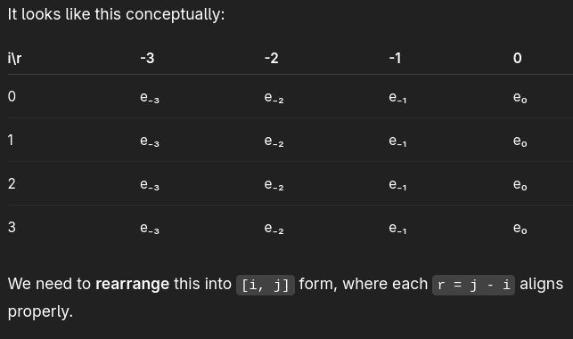
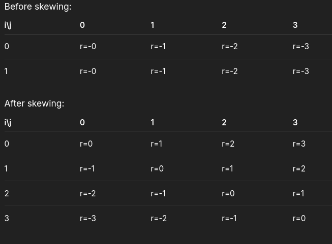

What problem are we solving?

The Music Transformer uses relative positional attention (Huang et al., 2018).
Instead of using absolute positions (like “this is note #5”), it uses relative distances (like “this note is 3 steps after that one”).

So during attention, we want:

Attention(i,j)=f(distance between i and j)
Attention(i,j)=f(distance between i and j)

That “distance” is:

r=j−i
r=j−i

But — when we compute Q * Eᵀ (where E is the relative position embedding),
the resulting tensor has wrong alignment: it’s indexed by [i, r] (position and relative distance),
but we need [i, j] (position and actual other token).

👉 The skew() function fixes this misalignment — it shifts columns so that each relative distance r aligns with the correct key position j.

Step-by-step intuition

Let’s assume a toy case with sequence length L = 4.

We want a 4×4 attention matrix (query positions i × key positions j):

Each entry (i, j) depends on the relative distance r = j - i.

So we want the embedding for:

r = 0 on the main diagonal

r = 1 on the first upper diagonal

r = -1 on the first lower diagonal, etc.

But before skewing…

When you multiply Q * Eᵀ,
you get a tensor t of shape [L, L],
where the second dimension corresponds to relative distance indices, not key positions.

It looks like this conceptually:

We need to rearrange this into [i, j] form, where each r = j - i aligns properly.

Skewing operation = “shift diagonals into columns”

The skew() does that through 3 clever tensor operations:

def skew(t):
    padded = F.pad(t, [1, 0])                # Step 1: add a column of zeros on the left
    Srel = padded.reshape(-1, t.shape[-1]+1, t.shape[-2])  # Step 2: reshape to diagonalize
    Srel = Srel[:, 1:]                       # Step 3: drop the first extra column
    Srel = Srel.reshape(*t.shape)            # Step 4: reshape back
    return Srel

Step 1️⃣ — Pad

Add one column of zeros to the left of t:

If t =
a b c d
e f g h
i j k l
m n o p

After padding:
0 a b c d
0 e f g h
0 i j k l
0 m n o p

Now we have shape (L, L+1).

Step 2️⃣ — Reshape

Srel = padded.reshape(-1, t.shape[-1] + 1, t.shape[-2])

This transposes the data in a way that shifts each row’s columns one step down — essentially turning columns into diagonals.

This operation aligns each relative distance r with the correct (i, j) pair.

Step 3️⃣ — Slice

Srel = Srel[:, 1:]

We remove the first column, which was only used for the shift.

Step 4️⃣ — Reshape back

Finally, we reshape it back into the original [L, L] shape.

Now each diagonal corresponds to a constant relative distance —
so (i, j) now correctly maps to the embedding for r = j - i.

Result

✅ Now every (i, j) points to the correct relative position embedding!